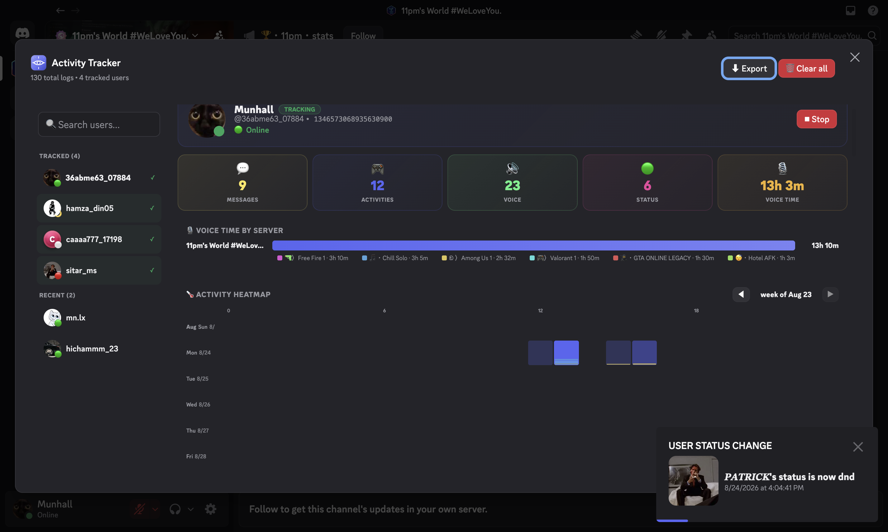
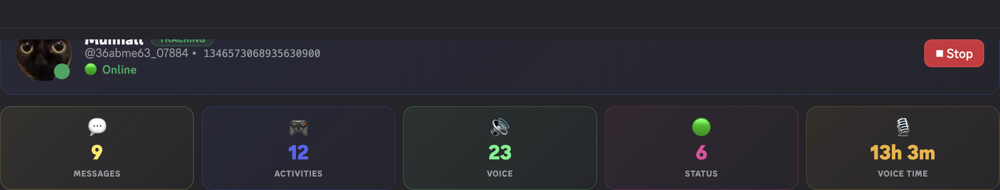
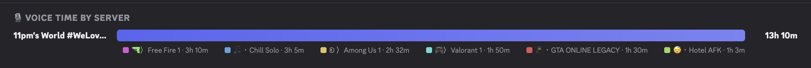
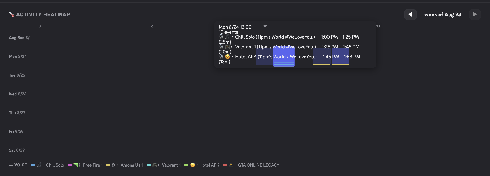
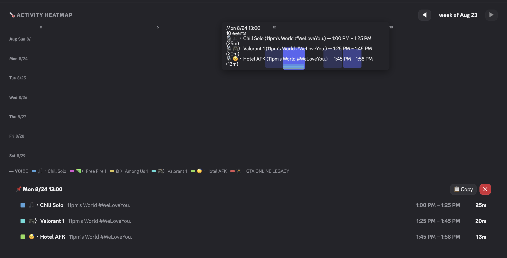
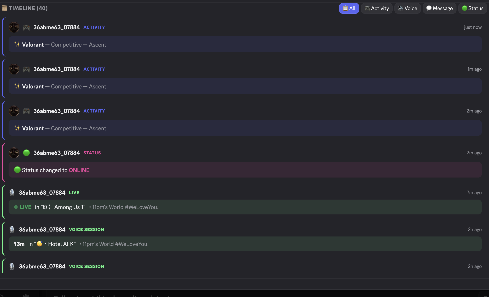

# Discord Activity Tracker

A Vencord plugin that tracks Discord user activities — voice channel sessions, messages, status changes, and gaming/Spotify activity — and visualizes everything in an interactive dashboard.

## Features

- **Voice session tracking** — join/leave/move events are paired into single sessions with duration, server, and channel (ongoing sessions show a LIVE badge)
- **Activity tracking** — gaming, Spotify, streaming, and custom activities
- **Message logging** — messages from tracked users with channel and server
- **Status changes** — online / offline / idle / dnd updates
- **Interactive dashboard**:
  - Per-user profile with live presence (avatar, status, current activity, track/stop toggle)
  - Stat strip — messages / activities / voice / status counts plus total voice time
  - **Voice time by server** — ranked bars with per-channel chips and durations
  - **Activity heatmap** — week-by-week grid with voice sessions drawn as thin proportional lines; hover any hour for the exact channels and time windows, click to pin a copyable breakdown, ◀/▶ to walk through weeks
  - **Timeline** — every event, with voice sessions merged into single entries (duration + LIVE badge)
  - Filter by activity type, search by username/ID, export JSON/TXT/CSV, clear all

## Preview

Screenshots captured against a real development server, showing actual members and channels:

### Dashboard overview


The full dashboard: sidebar with member avatars and presence dots, plus the selected user's profile card.

### Profile & stats


Profile card — real avatar, TRACKING badge, live status with current activity — above the stat strip.

### Voice time by server


Total voice time grouped by server, with a channel chip and duration for every voice channel the user joined.

### Heatmap hover


Hovering an hour cell reveals every voice session in that hour — channel, server, exact time window, and duration.

### Heatmap pinned breakdown


Clicking an hour pins a breakdown of every channel window in that hour, with a one-click copy button.

### Activity timeline


The chronological timeline with paired voice sessions — single entries with durations and a LIVE badge on the ongoing session.

## Installation

This is a **Vencord plugin**. You need to have [Vencord](https://vencord.dev/) installed.

1. Clone or download this repository
2. Copy the entire `ActivityTracker` folder to `Vencord/src/userplugins/`
3. Run `pnpm build` in your Vencord directory
4. Run `pnpm inject` to patch discord with vencord (including the Discord-Activity-Tracker plugin)
5. Start discord (needs to be closed when running `pnpm inject`)
6. Enable "ActivityTracker" in Vencord settings

## Usage

### Right-Click Menu

Right-click any user to access:
- **Activity Tracker** — Opens the dashboard
- **Start / Stop Tracking User** — Toggle tracking for that user

### Console Commands

```js
// Open dashboard
Vencord.Plugins.plugins.ActivityTracker.openDashboard()

// Track user
Vencord.Plugins.plugins.ActivityTracker.trackUser("USER_ID")

// Stop tracking
Vencord.Plugins.plugins.ActivityTracker.untrackUser("USER_ID")

// View logs
Vencord.Plugins.plugins.ActivityTracker.getActivityLogs()
```

## Dashboard

- **Filter by User** — click a user in the sidebar to load their full profile
- **Search** — search by username or user ID
- **Export Options**
  - Export JSON — full structured data
  - Export TXT — human-readable format
  - Export CSV — spreadsheet-friendly rows
- **Clear All** — 🗑 remove all logs and tracked users
- **Tracked / Recent** — tracked users get a green checkmark and appear first

## Tracked Data

- **Activities**: Gaming, Spotify, Streaming, Custom Status, Rich Presence
- **Voice**: Join/Leave/Move merged into sessions with channel name and server name
- **Messages**: Full message content from tracked users
- **Status**: Online, Offline, Idle, Do Not Disturb changes

## Credits

Developed by [Elioflex](https://github.com/elioflex)

## License

MIT
